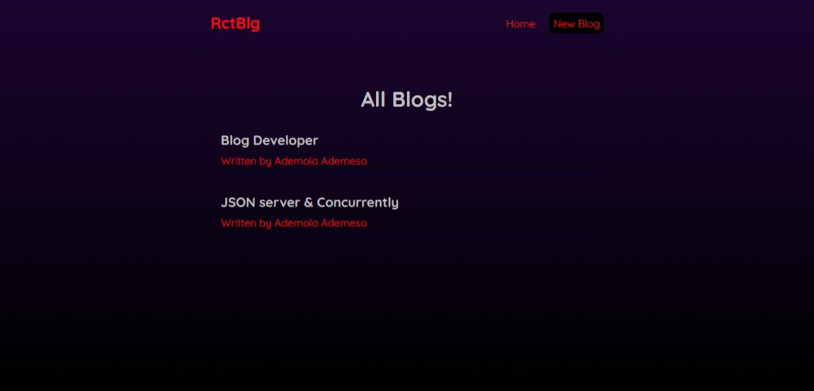

# RctBlg

This is a mini blog web react app where by the Vite development server is integrated with JSON server on port 8000 to run concurrently and to fetch data from JSON server. This setup allows us to use JSON server to mock the backend API for the front-end development.

## Features

- List different articles
- Delete articles
- Create new articles
- View each article details by clicking on them from the home page
- Custom error page for all paths that don't exist
- Fetches data from the db.json file using JSON server as the mock API
- Requests handled by the react-router-dom

## Demo

[Click here to see the live demo](https://ademolaademeso-rctblg.vercel.app)

## Screenshot

